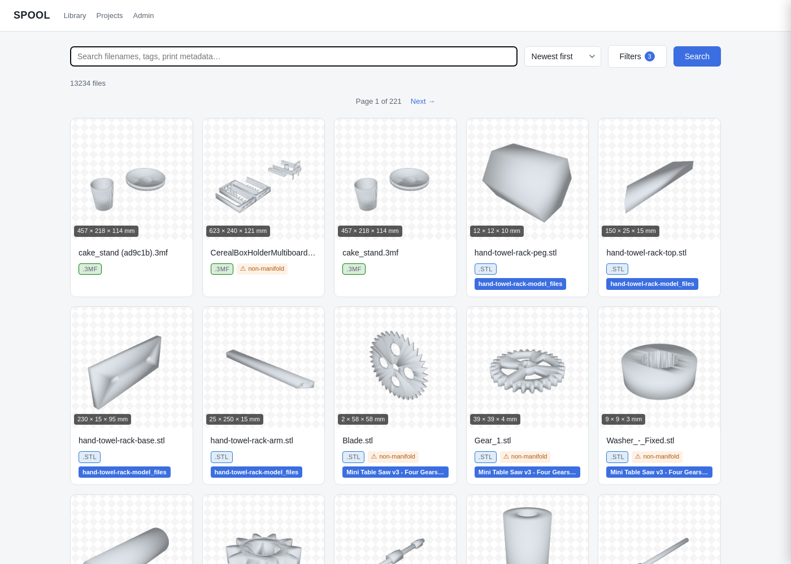

# SPOOL

A local, searchable library for your 3D printing files (`.stl`, `.3mf`, `.step`,
`.svg`, `.scad`, `.gcode`, `.obj`). SPOOL watches your folders, hashes and indexes every file
into Postgres, renders a real preview thumbnail for each one, and serves a
searchable web page so you can find and preview a file before opening it in
Fusion or Bambu Studio — no more digging through folders full of
`bracket_v2_final_ACTUAL.stl`.



## What it does

- **Watches your folders** — a drop folder, your existing library, and
  Downloads (auto-relocated into the drop folder) are indexed automatically
  as files arrive, plus a periodic rescan catches anything a live filesystem
  event missed (moved, edited, or deleted files).
- **Real previews, not icons** — STL/3MF/OBJ are rendered via `trimesh`/`pyrender`;
  STEP is tessellated through OpenCASCADE (`cadquery-ocp`) first; SVG renders
  itself; sliced `.gcode` shows the preview image your slicer already embedded
  in it, if it wrote one; a watertightness check flags files that won't slice
  cleanly.
- **Search and browse** — search-as-you-type across filenames, tags, and
  print metadata (material, printer, slicer, your own print notes), filter by
  extension, color-coded by file type. Hyphens, underscores, and spaces are
  treated as the same thing, so searching "cake stand" finds a file
  literally named `cake_stand.stl`.
- **Tags, nestable projects, print metadata** — organize files by hand, or
  let SPOOL auto-suggest a project for files that share a folder.
- **Relationships** — link a STEP file to the STL exported from it, or a part
  to its next revision, with auto-suggested `duplicate_of` /
  `new_version_of` / `derived_from` detection based on content hash and
  filename patterns.
- **Archive review** — a `.zip`, `.7z`, or `.rar` containing a recognized
  model file gets surfaced for you to confirm or dismiss before anything is
  extracted; nothing unrelated to 3D printing is ever touched.
- **Duplicate cleanup** — files with byte-identical content are grouped for
  review, with bulk select/delete.
- **Printed tracker** — mark a file as printed, rate it, and leave yourself
  notes on how it turned out.
- **Open in your CAD/slicer app** — a small native helper (macOS and
  Windows both supported) launches Fusion, Bambu Studio, or whatever you
  use directly from the file's page — the one piece that isn't Docker,
  since a Linux container can't launch a GUI app on your actual machine.

## Requirements

- macOS or Windows (the "open in your CAD/slicer app" and "delete a
  duplicate" pieces need a small native helper program specific to each —
  everything else is just Docker, so both platforms get the exact same
  web app)
- Docker Desktop (free — see step 1 below). **Install and open this
  before running the setup script** — the script checks for it and will
  stop and point you to the download page if it's missing, so it's
  smoother to just get it out of the way first.
- Python 3 (macOS usually already has this; Windows needs a separate
  install — see the Windows section below). Used by the setup script to
  auto-detect your CAD/slicer apps, and separately to run the automated
  test suite. Neither of those is required to actually use SPOOL day to
  day — if Python isn't there, setup just skips the app auto-detection
  step with a note, and you can configure that part by hand later (or
  skip the test suite entirely, most people setting this up just to use
  it never need it).

**Windows users**: jump to [Windows setup](#windows-setup) below — it's a
single script rather than the click-by-click walkthrough that follows,
which is written for macOS. (The Windows path is newer and has seen less
real-world use than the macOS one — if something looks off, the
"Known limitations" section has a couple of Windows-specific notes.)

## Setting up on your own machine (macOS)

These steps assume you've never used Terminal or Docker before — if you
already have, skip ahead freely. Every command below is meant to be copied
and pasted exactly as written, one at a time, pressing Return after each.

### Step 0: Open Terminal

Terminal is the app you'll paste commands into. Open it with
**Spotlight**: press `Cmd + Space`, type `Terminal`, press Return. A window
with a text prompt appears — that's it, that's Terminal. Leave it open;
every command in these instructions gets typed (or pasted) there.

### Step 1: Install Docker Desktop

SPOOL runs inside Docker, which keeps everything it needs (the database,
the web server, etc.) neatly contained instead of installed loose on your
Mac.

1. Go to <https://www.docker.com/products/docker-desktop/> and download
   Docker Desktop for Mac (pick Apple Silicon or Intel — if you're not
   sure which, click the Apple logo top-left → "About This Mac" and check
   the chip listed there).
2. Open the downloaded file and drag Docker into Applications, same as
   any other Mac app.
3. Open Docker Desktop from Applications. The first launch asks for a
   few permissions — accept them. Wait until the little whale icon in
   your menu bar (top of the screen) stops animating and Docker Desktop's
   own window says it's running. **Docker Desktop needs to be open and
   running every time you use SPOOL** — if the whale icon isn't in your
   menu bar, SPOOL won't work until you open Docker Desktop again.

### Step 2: Get the SPOOL code onto your Mac

If you were sent a link to this project's GitHub page: click the green
**Code** button, then **Download ZIP**. Once it downloads, double-click the
ZIP file in your Downloads folder to unzip it, then drag the resulting
folder somewhere you'll remember (your Documents folder is a good choice).

Now tell Terminal to work inside that folder — type `cd ` (with a trailing
space), then drag the folder itself from Finder into the Terminal window
(this pastes its full path in automatically), then press Return. Your
prompt should now show the folder's name, confirming you're "in" it.

(If you're comfortable with git instead: `git clone <the repo URL>` and
`cd` into the folder it creates.)

### Step 3: Run the setup script (recommended)

The rest of setup — telling SPOOL which folders to watch, starting it,
and wiring up "open in" for your CAD/slicer apps — is one script:

```bash
./setup.sh
```

It asks for your **drop folder** (required — your main working folder,
the one that actually needs real files in it), then asks whether you
have an **existing library** to index too and whether you want
**Downloads** auto-managed, popping up a native Finder window for
either one you say yes to and leaving it out of your setup entirely if
you say no — see "Step 3b: Tell SPOOL which folders to watch" below for
the full explanation of each one. Rather than making you hand-edit a
config file, it generates a
database password for you so there's nothing to remember, waits for
each step to actually finish before moving to the next, and tells you
plainly if something didn't work. It also looks at what's in your
`~/Applications`/`/Applications` folder and tries to guess your CAD
program and slicer automatically, asking you to confirm or pick from a
list rather than requiring you to know the exact `.app` file name up
front.

**It's completely safe to run more than once** — if it finds a `.env` you
already set up, it asks whether to keep it before touching anything, so
re-running it later (say, after downloading an updated copy of SPOOL) to
pick up changes won't undo your configuration.

Follow the prompts it prints, and skip ahead to
[**Using SPOOL**](#using-spool) once it says you're done. If anything
about it fails, or you'd rather understand/control every step yourself,
the exact same setup broken into individual pieces follows below —
nothing in `setup.sh` does anything you can't also do by hand.

### Manual setup, step by step

Skip this whole section if `./setup.sh` above already worked for you.

#### Step 3b: Tell SPOOL which folders to watch

SPOOL needs to know three real folders on your Mac. They each do a
different job:

- **Drop folder** ("DROPFOLDER_HOST_PATH") — this is SPOOL's main working
  folder. It's read-write, and it's where you'd put a new kit you've
  downloaded and unzipped, or where files land after being auto-moved
  out of Downloads (see below). **This one's required** — it's the
  folder SPOOL is built around, and the only one it can't run without.
- **Library** ("LIBRARY_HOST_PATH") — your *existing*, already-organized
  collection of 3D print files, if you have one (e.g. years of files
  sitting in a folder from before you had SPOOL). It's mounted
  **read-only** — SPOOL only looks at what's already there to index and
  search it; it will never move, rename, or delete anything inside it.
  **Optional** — if you don't have an existing library, just leave this
  one blank (see below) and SPOOL will only watch your drop folder.
- **Downloads** ("DOWNLOADS_HOST_PATH") — normally your Mac's actual
  Downloads folder. SPOOL watches it specifically for new 3D-print files
  and **automatically moves them into your drop folder** the moment
  they finish downloading, so Downloads doesn't just become another pile
  of clutter. **Optional** — leave it blank if you'd rather manage
  Downloads yourself and just drop files into your drop folder directly.

**Only the drop folder is required.** Leaving Library and/or Downloads
blank means SPOOL simply won't have that feature active — nothing
breaks, there's just one less (or two less) folder(s) being watched.
One thing worth knowing if you skip one now and want it later: adding it
isn't as simple as editing `.env` and restarting (the same is true of
adding any watched folder after first setup) — see "Adding a folder you
initially skipped" under Known limitations for the extra step involved.

These paths are set in a file called `.env`, which doesn't exist yet —
you copy it from a template.

Paste this into Terminal and press Return:

```bash
cp .env.example .env
```

Nothing appears to happen — that's normal, it just means it worked. Now
open the new `.env` file in TextEdit by pasting this and pressing Return:

```bash
open -e .env
```

You'll see a handful of lines like `DROPFOLDER_HOST_PATH=...`. Set
`DROPFOLDER_HOST_PATH` to a real folder on your Mac. For `LIBRARY_HOST_PATH`
and `DOWNLOADS_HOST_PATH`, either set them too, or leave them exactly as
`LIBRARY_HOST_PATH=` (nothing after the `=`) to skip that one entirely —
for example, to use a library but skip Downloads auto-move:

```
DROPFOLDER_HOST_PATH=/Users/yourname/Documents/3DPrintFiles
LIBRARY_HOST_PATH=/Users/yourname/Documents/3D Printing
DOWNLOADS_HOST_PATH=
```

(Tip: if a folder doesn't exist yet, create it in Finder first — Docker
needs the real folder to already be there.) Also change
`POSTGRES_PASSWORD` from the placeholder to anything else — it's just a
password for the database SPOOL keeps on your own Mac, not something you
need to remember or share. Save the file (`Cmd + S`) and close TextEdit.

#### Step 4b: Start SPOOL

Back in Terminal, paste this and press Return:

```bash
docker compose up -d --build
```

This downloads and builds everything SPOOL needs — the first time, it can
take several minutes (you'll see a lot of text scroll by; that's normal).
When it finishes and gives you a new prompt, check that everything started
correctly:

```bash
docker compose ps
```

You should see five services (`postgres`, `api`, `watcher`, `worker`,
`worker-step`) all saying `running` or `Up`.

Now open the actual app: open any web browser (Safari, Chrome, Firefox —
whatever you normally use), click once in the address bar at the very
top of the window (where a website's address normally shows), type or
paste the following, and press Return:

```
http://localhost:8000
```

This isn't a real website out on the internet — "localhost" is a special
address that always means "the thing running on this same computer,"
which is exactly what SPOOL is. It'll work fine even with Wi-Fi off,
and no one outside your own computer can reach it. You should now see
SPOOL's search page, currently empty or nearly so. Your three folders
from `.env` start being indexed automatically in the background — if
they contain a lot of files, thumbnails will keep appearing over the
next while as SPOOL works through them; there's nothing else you need
to click or run for that to happen, just wait and refresh the page
occasionally.

Once it's loaded once, most browsers let you bookmark it (the star icon
in the address bar) so you can get back to `http://localhost:8000`
without retyping it — worth doing, since you'll come back to this same
address every time you use SPOOL.

*(If you ever change a folder path in `.env` later, editing the file
alone won't update an already-running SPOOL — go to the `/admin` page in
the browser and edit the path there instead.)*

#### Step 5b: Install the host-helper (lets SPOOL open files in Fusion/Bambu Studio)

Everything above runs inside Docker, which — deliberately, for safety —
can't reach out and open another app on your actual Mac. One small
separate helper program handles just that piece; it's not Docker, it's a
tiny program that starts automatically in the background whenever you log
in to your Mac.

Easiest path — let it look at what's installed and ask you to confirm:

```bash
python3 host-helper/configure_apps.py
```

It scans `~/Applications`/`/Applications`, guesses your CAD app and
slicer, and asks you to pick from a numbered list if it finds more than
one candidate (or if it finds none, lets you type the exact name
yourself). This is exactly what `./setup.sh` already ran for you if you
used it above — running it again re-asks and overwrites the previous
choice, so it's fine to change your mind later.

If you'd rather do it by hand instead: open `host-helper/host_helper.py`
(find it in Finder, inside the SPOOL folder, and open it with TextEdit)
and look for a section called `APP_MAP`. The name has to be the *exact*
file name of the app as it sits in your Applications folder, not its
display name — to check, paste this in Terminal:

```bash
ls ~/Applications /Applications
```

and use exactly what's printed there (e.g. some apps are named slightly
differently than you'd expect — "Autodesk Fusion.app", not
"Fusion 360.app"). There's a matching `APP_MAP` in
`services/api/spool_api/host_helper_client.py` too — keep both in sync.

Either way, finish by running:

```bash
host-helper/install.sh
```

If you ever change `host_helper.py`, `host_helper_client.py`, or `.env`
again later, re-run that same command (and `docker compose up -d --build
api` too, if you changed `host_helper_client.py`) to pick up the change.

#### Step 6b: One-time permission for deleting duplicate files

Everything works right away except one specific feature: actually
deleting a file from the duplicate-files review page (opening a file in
Fusion/Bambu Studio needs no extra setup). If you try to delete a
duplicate and see "Operation not permitted," macOS is blocking it for
safety. To allow it, only once:

1. Open **System Settings**.
2. Go to **Privacy & Security → Full Disk Access**.
3. Click the **+** button, press `Cmd + Shift + G` to open the "Go to
   folder" box, type `/usr/bin`, press Return, then select `python3` and
   add it.

That's it — SPOOL is fully set up. Bookmark `http://localhost:8000` and
come back to it any time Docker Desktop is running.

## Windows setup

Everything above this section is written for macOS. The underlying app
(Docker, Postgres, the web page) is identical on both platforms — the
only thing that's genuinely different per OS is the small native helper
that lets SPOOL open a file in Fusion/Bambu Studio and delete duplicates,
since that needs real access to your actual machine, not just a
container.

1. **Install Docker Desktop** from
   <https://www.docker.com/products/docker-desktop/> (download, run the
   installer, then open Docker Desktop from the Start menu and wait until
   it says it's running — same idea as macOS's step 1 above, just a
   different installer).
2. **Install Python** from <https://www.python.org/downloads/> if you
   don't already have it — during setup, check the box that says **"Add
   python.exe to PATH"**. (Used to auto-detect your CAD/slicer apps; skip
   this and you can still configure them by hand later.)
3. **Get the SPOOL code** the same way as macOS step 2 above (download
   ZIP from GitHub and unzip it, or `git clone`), then open it: right-click
   the folder in File Explorer and choose **"Open in Terminal"** (or
   **PowerShell**).
4. **Run the setup script**:

   ```powershell
   .\setup.ps1
   ```

   If you see an error like *"running scripts is disabled on this
   system"*, that's PowerShell's default safety setting blocking an
   unsigned script — run this first, in the same window (it only affects
   this one window, not your whole computer), then try `.\setup.ps1`
   again:

   ```powershell
   Set-ExecutionPolicy -Scope Process -ExecutionPolicy Bypass
   ```

   The script asks for your drop folder (required), then asks whether
   you have an existing library to index and whether you want Downloads
   auto-managed, popping up a folder picker for either one you say yes
   to (not sure what these mean? see "Step 3b: Tell SPOOL which folders
   to watch" above — same three folders, same meanings, just asked about
   interactively here instead of typed into a file). It also generates a
   database password for you, starts everything, and tries
   to auto-detect your CAD/slicer apps the same way the macOS script
   does (scanning `Program Files` and similar folders for a recognizable
   install, asking you to confirm or type the exact path if it's not
   sure). Right at the end it opens SPOOL for you automatically in your
   default web browser — that's how you'll know it worked, no need to
   type any address in yourself. It's safe to run this whole script more
   than once. One genuine difference from macOS: there's no separate
   permission step needed for deleting duplicate files — Windows' own
   normal file permissions already cover that, so setup finishes in one
   fewer step.

5. Once it says you're done, skip up to [**Using SPOOL**](#using-spool)
   — everything from there on is identical regardless of which OS you
   set up on.

If you'd rather not run a script at all: the same handful of steps —
`copy .env.example .env` and edit it (using forward slashes in the paths,
per the comment in that file), `docker compose up -d --build`, `python
host-helper\configure_apps.py`, then `powershell -ExecutionPolicy Bypass
-File host-helper\install_windows.ps1` — do exactly what `setup.ps1`
does, just without the folder-picker windows or the friendly
progress messages.

## Using SPOOL

**Give it time after first setup.** SPOOL doesn't wait for you to ask —
the moment it starts, it's already walking your drop folder and library
in the background, hashing every file and rendering a thumbnail for each
one. For a library of a few hundred files that's minutes; for several
thousand, it can be a while. You don't need to do anything — just refresh
the library page occasionally, or watch progress live on `/admin/status`
(a running counter of files hashed/rendered/failed and what's currently
being worked on).

### Browsing and searching

The home page (`http://localhost:8000`) is a grid of thumbnails, newest
first. Type in the search box at the top to filter live as you type — it
searches filenames, tags, and print metadata (material, printer, slicer,
your own notes) all at once, and treats hyphens/underscores/spaces as
interchangeable, so "cake stand" finds `cake_stand.stl` too. Click
**Filters** for a side panel with extension, tag, star rating, "printed"
status, and material/printer/slicer dropdowns; the **sort** dropdown next
to search covers newest/oldest/name/size. Click any card to open that
file's own page — dimensions, whether it's watertight (manifold), tags,
project membership, any auto-extracted or manually-entered print
settings, related files, and buttons to open it directly in your CAD or
slicer app.

### Organizing: tags and projects

On a file's page, click the small **+** next to Tags or Project to add
one (or create a new project on the spot). Double-click a file's name or
a project's name to rename it in place. You don't have to organize
everything by hand, though — SPOOL watches for files that share a folder
and suggests a project for them automatically; those show up as a
lighter, dashed-outline chip with a checkmark/× to confirm or dismiss.
The same auto-suggestion happens for relationships (e.g. a `.stl`
detected as probably exported from a `.step` file with the same name).

If suggestions pile up faster than you want to review them one at a time,
`/admin` has dedicated bulk-review pages for suggested projects and
suggested relationships, each with a "confirm all" option.

### Marking what you've printed

On a file's page, click the small printer badge over the thumbnail to
open a form: a "printed" checkbox, a 1–5 star rating, and a free-text
note to yourself (how the print went, what settings you used, etc.).

### Opening a file in Fusion/Bambu Studio (or whatever you configured)

Every file's page has one icon button per app you configured during
setup, right next to its file path — click one to open that exact file
in that exact app. The app matching the file's own type (e.g. your
slicer for a `.stl`) gets a highlighted border as the obvious default,
but every configured app is always clickable for any file.

### Reviewing what SPOOL found: the Admin page

`/admin` is mission control for everything that needs a human decision:

- **Pending archives** — a `.zip`/`.7z`/`.rar` SPOOL noticed contains a
  recognized model file, waiting for you to confirm (extract it) or
  reject (ignore it forever). **Nothing is extracted automatically.**
- **Duplicate files** — groups of files with byte-identical content,
  with a bulk-select-and-delete flow.
- **Suggested projects** / **suggested relationships** — the bulk-review
  pages mentioned above.
- **Rejected archives** — anything you've dismissed, in case you change
  your mind.
- **Watched roots** — edit the label, pause, or reactivate any of your
  three configured folders.
- **Status** — the live processing dashboard mentioned above: what's
  running right now, recent successes/failures (with the full error for
  anything that failed), and per-folder file counts.

## Best practices for testers

- **This is a personal, single-user tool, not a shared service.** There's
  no login and no per-user separation — SPOOL is meant to run on *your
  own* computer against *your own* folders. If several of you are trying
  it out, each person should do their own setup on their own machine
  (their own `.env`, their own `http://localhost:8000`), not share one
  running copy over a network.
- **Confirming an archive deletes the original after extracting it.**
  Once you click Confirm on `/admin/pending-archives`, SPOOL extracts the
  contents into your drop folder and removes the original `.zip`/`.7z`/
  `.rar` — there's no undo. If you're not sure yet, click Reject instead
  (you can un-reject it later from `/admin/rejected-archives` with the
  original file untouched) rather than experimenting with Confirm on
  something you care about.
- **Deleting a duplicate is permanent** — it removes the real file from
  disk, not just the SPOOL record of it.
- **"Select all" only ever applies to what's currently on the page** on
  the bulk-review admin pages — it won't silently reach into suggestions
  you haven't scrolled to yet, but do check what's actually checked
  before clicking a bulk "accept"/"delete" button, especially if you've
  turned the page size up.
- **A big first import takes real time and CPU**, especially STEP files
  (they go through a separate, slower rendering lane specifically so they
  don't block everything else) — this is expected, not a hang. Check
  `/admin/status` before assuming something's stuck.
- See **Known limitations** below for a few sharp edges worth knowing
  about up front (cloud-synced folders, the read-only Library root, and
  what does/doesn't need a restart after a config change).

## Found a bug, or something confusing?

Please file it as a **GitHub issue** rather than just mentioning it in
passing — it's the one place that won't get lost, and lets more than one
of you comment on the same thing.

1. Go to the **Issues** tab at the top of the repo's GitHub page (or
   <https://github.com/joannewood/spool/issues> directly), then click the
   green **New issue** button.
2. Give it a short, specific title (e.g. "Setup script fails on the
   folder-picker step on Windows 11", not just "doesn't work").
3. In the description, include:
   - **What you did** (the exact steps, as best you can recall).
   - **What you expected** vs. **what actually happened**.
   - **Your OS** (macOS or Windows — and Windows version if you know it).
   - Any error text on screen, and if it's setup-related, the output of
     `docker compose ps` and `docker compose logs api` (or `logs worker`)
     pasted in — more context almost always beats less.
4. Click **Submit new issue**. That's it — no special permissions needed
   beyond having been added to the repo.

Screenshots help a lot for anything UI-related; drag an image straight
into the issue's text box on GitHub and it'll attach itself. General
feedback ("this would be more useful if...") is just as welcome as bug
reports — open an issue for those too rather than sitting on them.

## Day-to-day operations

### Useful commands

```bash
docker compose ps                   # check health
docker compose logs worker -f       # watch backfill/render/ingest activity
docker compose logs watcher -f      # watch live filesystem events
docker compose exec postgres psql -U spool -d spool   # inspect the data directly
docker compose down                 # stop (keeps your data — pgdata + thumbnails are named volumes)
docker compose down -v              # stop AND wipe all data — only if you're OK starting over
```

Quitting/restarting Docker Desktop stops every container (not just pauses
them) — your data survives in named volumes either way, so `docker compose
up -d` brings it all back with nothing lost.

```bash
host-helper/uninstall.sh                            # stop + remove the host-helper agent
launchctl print gui/$(id -u)/com.spool.hosthelper    # confirm it's running
tail -f ~/Library/Logs/spool/host-helper.log         # watch open/delete requests
```

### Running the test suite

```bash
docker compose up -d postgres        # only postgres needs to be running
python3 -m venv .venv
.venv/bin/pip install -r requirements-dev.txt
.venv/bin/pytest
```

Tests run on the host (not in a container) against a real, separate
`spool_test` database on the same Postgres instance (exposed at
`localhost:55432` for exactly this).

## Known limitations

- **The Windows path is newer and hasn't been exercised on real Windows
  hardware** the way the macOS path has (this project was built on a
  Mac) — the app-detection logic in `configure_apps.py` was validated
  against synthetic test cases for real installer layouts (including
  Autodesk's own deeply-nested one), but if `setup.ps1` or the Windows
  host-helper hits something unexpected on your machine, please report
  it rather than assuming it's supposed to work that way.
- **No automatic app icons on Windows yet.** macOS extracts each
  configured app's real icon from its `.icns`; Windows apps don't have an
  equivalent step wired up yet, so a Windows-configured app just shows a
  plain two-letter badge next to a file instead of its real icon —
  cosmetic only, "Open in..." still works normally.
- **Adding a folder you initially skipped isn't a single click** — this
  covers both "I left Library/Downloads blank at setup and want it now"
  and "I want a genuinely new, fourth watched folder." The admin page
  can only edit/pause roots that already have a database row; it can't
  create one.
  - If you left **Library or Downloads blank** at setup: their bind
    mounts already exist in `docker-compose.yml` (pointed at a harmless
    placeholder folder while blank), so you just need to (1) set the
    real path in `.env`, (2) run `docker compose up -d --build` to
    remount it there, then (3) add the row yourself, since the one-time
    seed script won't retroactively do it:
    ```bash
    docker compose exec postgres psql -U spool -d spool -c \
      "INSERT INTO watched_roots (host_path, container_path, label, kind, ingest_mode, active) VALUES ('/real/path/here', '/roots/library', 'Library', 'existing_library', 'index_in_place', TRUE)"
    ```
    (swap `/roots/library`/`'Library'`/`'index_in_place'` for
    `/roots/downloads`/`'Downloads'`/`'relocate_to_dropfolder'` if it's
    Downloads you're adding.)
  - For a genuinely new **fourth** folder beyond these three: Docker
    can't attach a brand-new bind mount to an already-running container
    at all, so you'd first need to add one to `docker-compose.yml`
    yourself, then `docker compose up -d --build`, then the same manual
    `INSERT` as above.
- **Changing a path in `.env` after first setup doesn't re-seed the
  database** — the seed only runs once, against a brand-new `pgdata`
  volume. Update the path on the `/admin` page instead (and re-run
  `host-helper/install.sh` if it's one of the delete-allowlist paths).
- **Archives can't be extracted from your Library folder.** It's mounted
  read-only (an "existing library" root is never supposed to be written
  to) — confirming a zip/7z/rar found there will fail with a permissions
  error in Admin, by design. Extract it yourself, or drop it in your drop
  folder instead.
- **Don't point a watched root at a folder under iCloud Drive sync (e.g.
  anywhere inside `~/Documents` or `~/Desktop` if "Desktop & Documents
  Folders" is on) while "Optimize Mac Storage" is enabled.** iCloud will
  periodically evict local copies of files you haven't touched recently
  back to cloud-only placeholders to save disk space. Docker Desktop's
  virtualized filesystem bridge doesn't trigger iCloud's on-demand
  download for these the way native macOS file access does, so the
  watcher/worker containers just get `OSError: [Errno 35] Resource
  deadlock avoided` trying to even `stat()` the file — indefinitely, not
  a transient error. Confirmed live: an affected file shows a real size
  in `ls -la` but `stat -f "blocks=%b"` reports `0`. Reading the file
  once from the host (Terminal, Finder, anything running directly on the
  Mac, not in a container) reliably materializes it and unblocks the
  container — but iCloud can evict it again later under storage
  pressure, so this isn't a one-time fix, it can recur on a shifting set
  of files indefinitely. The real fix is either turning off "Optimize Mac
  Storage" (System Settings → your Apple ID → iCloud → iCloud Drive →
  Options) so watched files always stay downloaded locally, or keeping
  watched folders entirely outside any iCloud-synced directory.

## Status

Nine build phases done — ingestion, mesh + STEP + SVG previews, browse/search,
tags/projects/print metadata, relationships, drift reconciliation, the native
open-in-app helper, and a growing backlog of quality-of-life features (search
across print metadata, duplicate cleanup, a printed/rating tracker, and more).
308 automated tests covering the ingestion pipeline and the API. Runnable
on someone else's Mac or Windows machine via a single guided `./setup.sh`
/ `.\setup.ps1` — watched-root paths and CAD/slicer app choices are both
configured interactively rather than hardcoded (see setup instructions
above), with the fully manual, step-by-step path still available for
anyone who wants it. The Windows path is newer and less battle-tested
than the macOS one (see Known limitations).

## License

[GPLv3](LICENSE) — free to use, share, and modify; if you distribute a
modified version, it needs to stay open under the same license. Copyright
© 2026 Jo Wood.

## Credits

<a href="https://www.flaticon.com/free-icons/3d" title="3d icons">3d icons created by Flat-icons-com - Flaticon</a>
